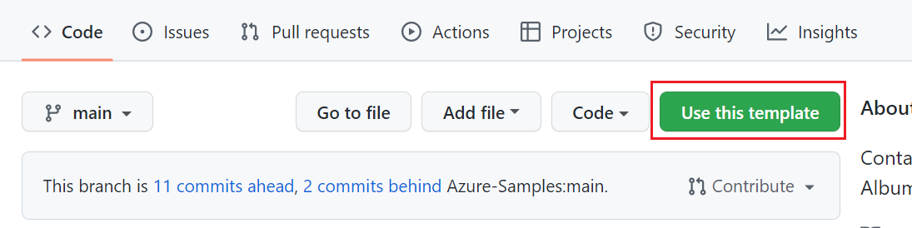
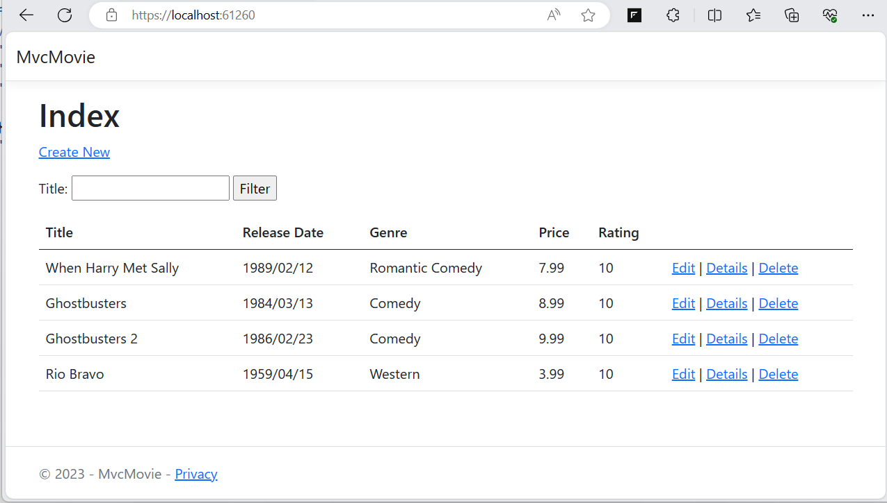
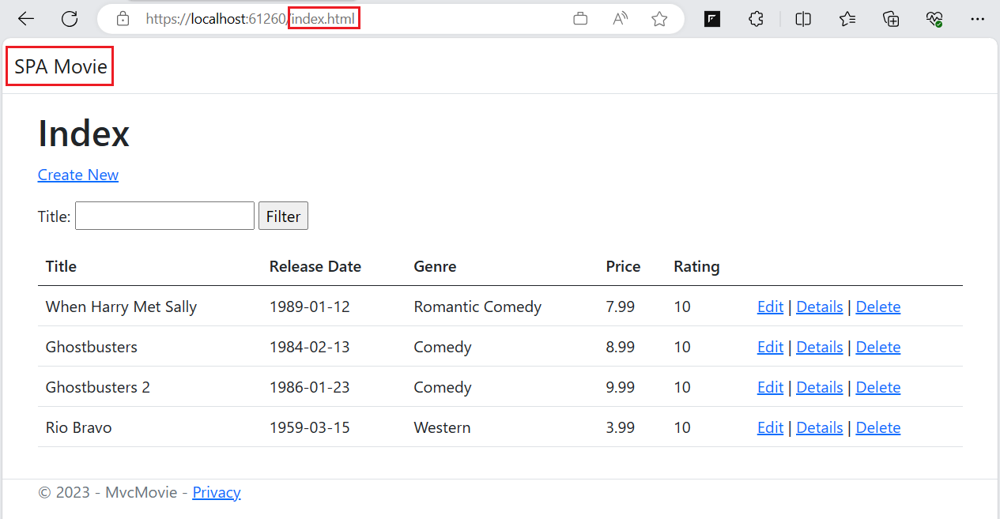
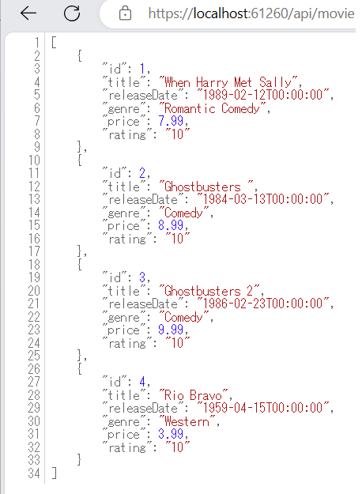

# MvcMovie

このプロジェクトは、Azure PaaS のデプロイから運用までを説明するハンズオン用のアプリケーションです。

.NET7 の MVC Framework で作成されており、SQL Server Express LocalDB を使用する都合上、Windows 上での動作を前提としています。

また、このアプリケーションは、[ASP.NET Core MVC のチュートリアル](https://docs.microsoft.com/ja-jp/aspnet/core/tutorials/first-mvc-app/?view=aspnetcore-5.0)をベースに、既存の機能に加え、REST API の機能とそれを使用して動作する Single Page Application (SPA) の機能を追加してあります。

## 動作環境

このプロジェクトをビルドするには Visual Studio 2022 が必要です。

Visual Studio をお持ちでない場合は以下のサイトからライセンスに合致するものをダウンロードしてインストールすることができます。


* [**Visual Studio Tools のダウンロード**](https://visualstudio.microsoft.com/ja/downloads/)


Windows 以外の OS を使用していて Visual Studio がインストールできない場合は、以下のページよりあらかじめ Visual Studio がインストールされた Windows 11 の仮想マシンをダウンロードして使用することができます。

* [**Windows 11開発環境を取得する**](https://developer.microsoft.com/ja-jp/windows/downloads/virtual-machines/)

また、Windows を使用しているけれども Visual Studio をインストールしたくない場合は、Windows 11 付属の Hyper-V マネージャーのメニュー \[**クイック作成**\] Visual Studio があらかじめインストールされた Windows 11 の仮想マシンを作成することができます。

なお、これら仮想環境には git ツールはインストールされておりませんので、仮想マシン内から以下の URL にアクセスし git ツールをインストールしてください。

* [**Git-Downloading Packege**](https://git-scm.com/download/win)

<br>

## プロジェクトの入手

本プロジェクトはハンズオンの GitHub Action の演習に使用するためテンプレートリポジトリとして作成されています。

同テンプレートを使用してユーザー自身のリポジトリを作成する必要があるため GitHub のアカウントが必要です。

GitHub のアカウントをお持ちでない場合は https://github.com/ にアクセスしアカウントを作成してください。

GitHub のアカウントを作成したら、以下の URL にアクセスし、本プロジェクトのテンプレートリポジトリを作成してください。

本リポジトリ テンプレートを使用した新規リポジトリの作成手順は以下のとおりです。

 1. 以下の URL にアクセスし、画面内のボタン `[Use this template]` をクリックします  
      https://github.com/osamum/MvcMovie 
      
      <br>
    
2. `Create a new project from MvcMovie` 画面の各項目を以下のように設定します
      
     |  項目  |  値  |
     | ---- | ---- |   
     | Owner * | 自身のアカウント |
     | Repository name * | MvcMovie |
     | Description (Optional) | 任意の説明 |
     | Public or Private|Public にチェック|
     | Include all branches | チェックしない|
   <br>
    
3. 同ページの `[Create repository from template]` ボタンをクリックしてご自身の GitHub アカウントに `MvcMovie` リポジトリが作成されたことを確認します
 
ここまでの手順で作成された自身の `MvcMovie` リポジトリの内容をご自身の PC にクローンしてください。

<br><br>

## プロジェクトのビルドと実行

PC ローカルにクローンしたプロジェクトをビルドして実行する手順は以下のとおりです。

1. Visual Studio 2022 を起動し、メニューの \[**ファイル**\] > \[**開く**\] > \[**プロジェクト/ソリューション**\] を選択します

2. ファイル選択ダイアログで、クローンしたプロジェクトのフォルダを選択し、`MvcMovie.sln` を選択して開きます

3. メニューの \[**ビルド**\] > \[**ソリューションのリビルド**\] を選択し、プロジェクトの依存関係のあるモジュールを再取得してビルドします

4. メニューの \[**ツール**\] > \[**Nuget パッケージマネージャー**\] > \[**パッケージ マネージャー コンソール**\] を選択し、Nuget パッケージマネージャー コンソールを開きます

5. Nuget パッケージマネージャー コンソールで、以下の 2 つのコマンドを順番に実行し、データベースを作成し、既定のデータを挿入します

    ```powershell
    Add-Migration InitialCreate
    Update-Database
    ```
6. メニューの \[**デバッグ**\] > \[**デバッグの開始**\] を選択し、プロジェクトを実行します

7. ブラウザーが起動し、`https://localhost:61260/` にアクセスします
    https で接続されるため、Web ブラウザーによってはセキュリティ警告が表示されますが、警告を無視してアクセスしてください。

    もし、警告の無視が場合は Web ブラウザーのナビゲーションバーにある URL の先頭の `https` を `http` に、ポート番号の `61260` を `61261` に変更してください。

8. アプリケーションが起動し、以下のような画面が表示されます

    

    これは ASP.NET MVC フレームワークがサーバーサイドで生成した画面です。

9. Web ブラウザーのナビゲーションバーの URL を以下のように変更します
    
    ```
    http://localhost:61261/index.html
    ```
    
    一見すると同じ画面に見えますが、左上に '**SPA**' とあるように、これは Single Page Application (SPA) となっており、クライアントサイドで JavaScript によって生成された画面です。

    

10. Web ブラウザーのナビゲーションバーの URL を以下のように変更します

    ```
    http://localhost:61260/api/movie
    ```
    この URL は REST API のエンドポイントとなっており、JSON 形式のデータが返されます。前述の SPA もこの REST API を使用して動作しています。

    

ここまでの手順で、本プロジェクトのビルドと実行が完了しました。

このアプリケーションの機能と URL の対応は以下のとおりです。

|  URL |  機能  |
| ---- | ---- |   
| http://localhost:61260/ | 動的 Web 画面 |
| http://localhost:61260/index.html | SPA |
| http://localhost:61260/api/movie | REST API |

<br>

これ以降の作業はハンズオン資料の内容にしたがって演習を進めてください。

